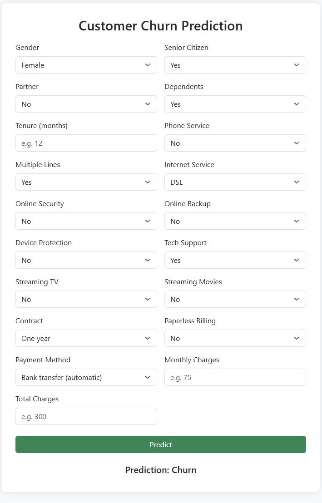

>>>>>>> dc94af4 (Updated README with dataset link and clean formatting)
# Customer Churn Prediction

This project is focused on predicting customer churn for a telecom company using various machine learning techniques. The project demonstrates an end-to-end Data Science pipeline including data preprocessing, modeling, evaluation, and deployment through a Flask web application.

---

## 📂 Project Structure

```
Customer-Churn-Prediction/
├── data/
│   └── WA_Fn-UseC_-Telco-Customer-Churn.csv
├── notebooks/
│   ├── 1_EDA.ipynb
│   ├── 2_Preprocessing_Modeling.ipynb
│   └── 3_Model_Evaluation_Interpretability.ipynb
├── deployment/
│   ├── app.py
│   ├── scaler.pkl
│   ├── churn_model_optimized.pkl
│   └── templates/
│       └── index.html
├── images/
│   └── [Saved Plots & Visualizations]
├── requirements.txt
└── README.md
```

---

## 📊 Dataset

- **Source:** [Kaggle - Telco Customer Churn Dataset](https://www.kaggle.com/datasets/blastchar/telco-customer-churn)
- **Features:**
  - Customer demographics, account information, services signed up for, etc.
  - Target: `Churn` (Yes/No)

---

## 🚀 Key Components

### 1️⃣ Exploratory Data Analysis (EDA)
- Visualized class imbalance
- Categorical vs target feature analysis
- Correlation heatmap of numeric features

### 2️⃣ Preprocessing & Modeling
- Handled missing values & irrelevant columns
- Label encoding of categorical variables
- Feature scaling (StandardScaler)
- Addressed imbalance using SMOTE
- Model: XGBoost Classifier
- Hyperparameter Tuning using GridSearchCV

### 3️⃣ Model Evaluation & Interpretability
- Classification Report, Confusion Matrix, ROC-AUC
- SHAP Explainability for feature impact analysis

### 4️⃣ Deployment
- Flask Web App with user-friendly dropdown options
- Real-time prediction based on user inputs

---

## 🏆 Results

- **Accuracy:**
  - Normal: 77%
  - Cross-validation: 81%

---

## 🌐 How to Use

### 1. Clone the Repository
```bash
git clone https://github.com/krishnagiri1/Customer-Churn-Prediction.git
cd Customer-Churn-Prediction
```

### 2. Install Requirements
```bash
pip install -r requirements.txt
```

### 3. Launch Web App
```bash
cd deployment
python app.py
```
Visit: [http://127.0.0.1:5000](http://127.0.0.1:5000)

### 4. Web App Interface
- Use dropdowns to select categorical features (No need to enter 0/1 manually)
- Input numeric values (Tenure, Monthly Charges, Total Charges)
- Click **Predict** to get churn prediction.

### 🌐 Live Web App
Try the deployed version here:  
👉 [Customer Churn Prediction](https://customer-churn-prediction-23n1.onrender.com/)

---

## 📸 Web App Screenshot



---

## 📌 Requirements

```
Flask==2.1.2
pandas==1.4.2
scikit-learn==1.1.1
numpy==1.23.0
xgboost==1.6.1
imbalanced-learn==0.9.1
matplotlib==3.5.1
seaborn==0.11.2
shap==0.40.0
joblib==1.1.0
```

---

## 📌 Future Improvements

- Try advanced ensemble models (e.g., LightGBM, CatBoost)
- Optimize further with Bayesian Optimization
- Dockerize for production deployment
- Add login/user authentication to the web app

---

## 📢 Contact

Connect with me on LinkedIn:

[Venkata Krishna Giri Koneru](https://www.linkedin.com/in/venkata-krishna-giri-koneru-6625101a9/)


---
